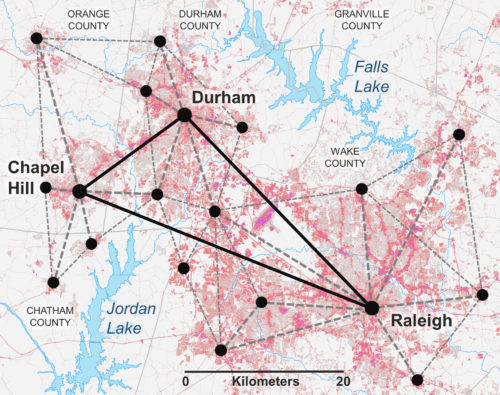

# TomorrowNow
Welcome to TomorrowNow, a visionary project to put big data and sophisticated models into the hands of everyone in the Triangle region of North Carolina. Join us!!

> What if **a game** could transform decision-making about stormwater in the Triangle? Would you like to be part of **designing** that game?

## What is TomorrowNow?

TomorrowNow is a collaborative project led by four universities in North Carolina focused on developing a **serious game** that can help a greater number, and a greater diversity, of people affect decisions that impact the places where they live and work. We are using real spatial data and developing interactive technologies that can help build common understanding of challenges in the Triangle, and figure out how to address them.
Funded by the National Science Foundation (Award Number [1737563](https://www.nsf.gov/awardsearch/showAward?AWD_ID=1737563&HistoricalAwards=false)), our Research Coordination Network unites government officials, academic researchers, industry leaders and members of community groups and other organizations to co-develop a serious game that will tackle challenges related to rapid urbanization and stormwater management in the Triangle.

> **WHAT IS A SERIOUS GAME?**
Serious games are designed for a real-world purpose. Not just for entertainment, they prompt players to devise a strategy or solve a realistic problem. Often, serious games use real data and computer models that mimic real-world processes and behaviors. They’re applied in a range of fields, from defense to education to emergency management to city planning.

## What has the project done so far?

### Built a network of thought leaders

We want our project team to be as diverse and inclusive as possible, and we are always looking for new members! 

**Universities:** North Carolina State University, University of North Carolina at Chapel Hill, Duke University, North Carolina Central University

**Municipalities:** City of Raleigh, City of Durham, Town of Chapel Hill, Town of Cary, Wake County, Durham County, Orange County

**Community and non-governmental organizations:** South Atlantic Landscape Conservation Cooperative, Water Resources Research Institute

> Want to join the conversation? Contact Network Coordinator [Corey White](ctwhite@ncsu.edu)

### Hosted two workshops to understand stormwater challenges

On May 16, 2018, over thirty project partners gathered at the Center for Geospatial Analytics for a kick-off workshop to discuss project goals and provide input on challenges and opportunities in the Triangle for stormwater management and civic engagement. We surveyed participants about their experiences and views and compiled their responses in a workshop report. Agree or disagree with anything in the report? We want to hear from you! Contact Network Coordinator Corey White and get access to the discussion on Slack.

On April 12, 2019, over thirty project partners again gathered at the Center for Geospatial Analytics to provide input for the development of the TomorrowNow prototype. Participants created fuzzy cognitive maps to serve as a basis for the game engine, identified stormwater problem areas in the Triangle and explored how to tackle these issues by collaboratively designing mini-games. A workshop report is forthcoming; until then, keep the conversation going on Slack!

## What's next?

### Keep brainstorming with us!

Thank you to all who attended the dynamic brainstorming workshop on April 12, 2019. Let’s keep talking on [Slack](https://tomorrownow.slack.com/)! Remember to introduce yourself on the #introductions channel, keep exploring stormwater issues in the #challenges channel and chime in on your team channels.

## How can I get involved?

> Can’t make it to a workshop? There are still plenty of ways to contribute to the TomorrowNow project. Do as much or as little as you like!

### Sign up for the beta!
Are you an early adopter? Enjoy playing with experimental beta versions of new technologies? Get in on the ground floor of TomorrowNow by signing up to test our forthcoming beta!
### Join the Stakeholder Advisory Board
Do you represent a community of people whose interests and needs should be heard at planning workshops and goal-setting meetings? Does your community have expertise in stormwater management or is directly impacted by it? Contact Network Coordinator [Corey White](ctwhite@ncsu.edu) to join the Stakeholder Advisory Board! Each member of the board is invited to in-person gatherings and automatically receives a login to TomorrowNow on [Slack](https://tomorrownow.slack.com/), the online forum that keeps discussion going between meetings.

### Attend Public Symposiums
In the future, the Research Collaboration Network will host public symposiums open to anyone who wants to attend. At these symposiums, the Interdisciplinary Steering Committee and Stakeholder Advisory Board will present project progress, share the latest research related to serious games, and seek feedback from attendees.

### Join TomorrowNow on Slack
Don’t have time to attend workshops or symposiums? No problem! The Research Collaboration Network maintains an online space for constructive discussion called TomorrowNow on [Slack](https://tomorrownow.slack.com/). This online forum hosts project updates and reports as well as discussion threads. We invite anyone interested in the project to contact [Corey White](ctwhite@ncsu.edu) to join the conversation. Make your voice heard by posting comments, or simply listen to what others have to say!